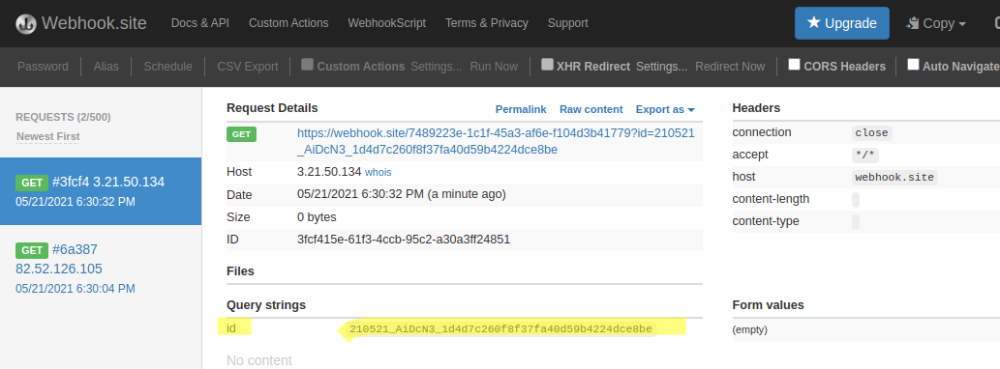

# wpt-action ⏱️

 [](https://coveralls.io/github/jackdbd/wpt-action?branch=main)

Unofficial GitHub action to run a test using the [WebPageTest REST API](https://product.webpagetest.org/api).

## Inputs

### `api_key`

**Required** — WebPageTest API key.

### `url`

**Required** — URL to test with WebPageTest.

### `block_urls`

Optional — Requests to these URLs will be blocked. Useful for blocking any third-party scripts on the page you are testing.

Example:

```yaml
block_urls: |
  www.block-some-ads.com
  www.block-some-more-ads.com
```

### `browser`

Optional — Browser to use for the test. Keep in mind that not all WebPageTest locations support all browsers.

Defaults to `Chrome`.

### `connectivity`

Optional — [Connection profile](https://docs.webpagetest.org/api/reference/#specifying-connectivity) to use for the test.

Defaults to `Cable`.

### `disable_javascript`

Optional — If `true`, WebPageTest will block any JavaScript on the page.

Defaults to `false`.

### `emulate_mobile`

Optional — If set to `true`, Chrome will emulate a mobile browser by adjusting the screen resolution, UA string and providing a fixed viewpoer. Read [this article](https://nooshu.github.io/blog/2020/12/31/how-to-run-a-webpagetest-test/#emulate-mobile-browser) for more info.

Defaults to `false`.

### `first_view_only`

Optional — Set this to `true` to skip the Repeat View test; set it to `false` to run a test against both the first view and the repeat view for a given test.

Defaults to `false`.

### `label`

Optional — A label for the test. Handy for identifying the test on the WebPageTest web UI.

### `location`

Optional — Identifier for a WebPageTest server. Example: `Dulles`, `London_EC2`, or `ec2-us-east-1`.

Defaults to `Dulles`.

### `pingback`

Optional — URL to ping when the test is complete. The test ID will be passed as an `id` query parameter.

Tip: you can try [Webhook.site](https://webhook.site/) to try this out. I use [n8n](https://n8n.io/) for this.



### `private`

Optional — Whethere the test should be visible in the public history log.

Defaults to `true`.

### `runs`

Optional — Number of runs to perform in a test.

Defaults to `1`.

### `tcpdump`

Optional — If true, WebPageTest will capture TCP packets using tcpdump.

Defaults to `false`.

### `video`

Optional — Whether to create a filmstrip to show how a web page loads.

Defaults to `false`.

### `wpt_server` (NOT tested)

Optional — WebPageTest server to use for the test. You'll need to provide this value only if you have your own WebPageTest [private instance](https://docs.webpagetest.org/private-instances/).

Defaults to `www.webpagetest.org`.

## Outputs

### `data`

A JSON-stringified object containing the WebPageTest test ID and links to WebPageTest results (JSON, XML, CSV). If you need to access a specific property, you can use [fromJson](https://docs.github.com/en/actions/reference/context-and-expression-syntax-for-github-actions#fromjson). For example:

```yaml
env:
  WPT_TEST_ID: ${{ fromJson(steps.wpt.outputs.data).testId }}
  WPT_JSON_URL: ${{ fromJson(steps.wpt.outputs.data).jsonUrl }}
```

## Example: basic

```yaml
name: 'WPT daily audit (workflow)'
on:
  schedule:
    - cron:  '0 0 * * *' # https://crontab.guru/daily
jobs:
  audit:
    name: WPT daily audit (job)
    runs-on: ubuntu-latest
    steps:
      - name: Checkout repo
        uses: actions/checkout@v2
      - name: Run WPT test
        id: wpt
        uses: 'jackdbd/wpt-action@v1.0.0'
        with:
          api_key: ${{ secrets.WEBPAGETEST_API_KEY }}
          url: https://www.google.com/
      - name: Dump data
        run: echo 'AUDIT DATA = ${{ steps.wpt.outputs.data }}'
```
